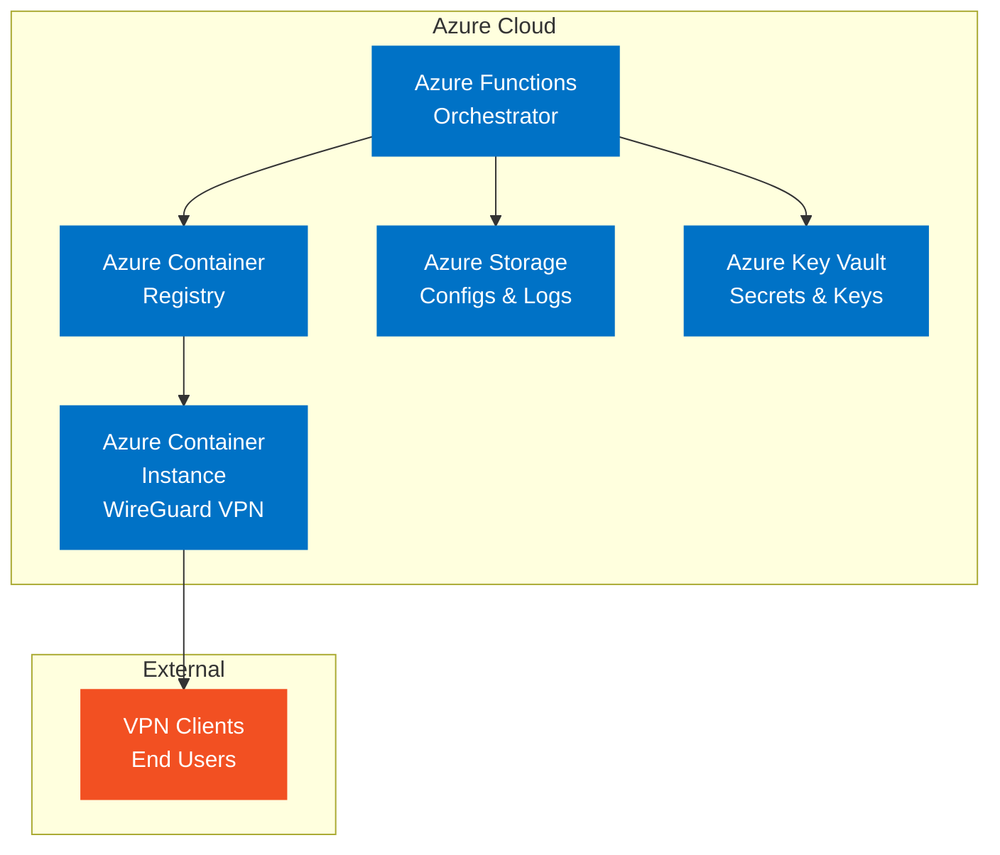

# MVP WireGuard Container-Based VPN Solution Specification

## Project Overview
**Project**: Azure Demand VPN - WireGuard Container MVP  
**Phase**: Phase 1 - Core Infrastructure  
**Timeline**: June 2025 - July 2025  
**Technology Stack**: Azure Container Instances, WireGuard, Azure Functions, Node.js  

## Executive Summary
This specification defines the Minimum Viable Product (MVP) for a container-based WireGuard VPN solution deployed on Azure Container Instances. The MVP will provide on-demand VPN provisioning through Azure Functions with basic security and monitoring capabilities.

## MVP Scope

### ✅ In Scope
- Basic WireGuard VPN server in container
- Start/Stop VPN via Azure Functions
- Client configuration generation
- Basic monitoring and logging
- Azure Container Registry integration
- Basic security configuration

### ❌ Out of Scope (Future Phases)
- Web-based user interface
- Advanced authentication (Azure AD integration)
- Multi-region deployment
- Advanced traffic analysis
- Split tunneling configuration
- Custom DNS integration

## Technical Architecture

### Core Components

## Detailed Task Breakdown

### 1. Infrastructure Setup

#### 1.1 Azure Resource Group Creation
- [ ] **Create resource group** `rg-az-demand-vpn-mvp` in target subscription
- [ ] **Set resource group tags** for cost tracking and project identification
- [ ] **Verify resource provider registrations** for Container Instances, Functions, Storage

#### 1.2 Azure Container Registry (ACR)
- [ ] **Create ACR instance** `acrazdemandvpn` with Basic SKU
- [ ] **Configure admin user** for initial image push access
- [ ] **Set up network rules** to allow Azure services access
- [ ] **Configure retention policies** for image cleanup
- [ ] **Set up RBAC** for managed identity access

#### 1.3 Azure Storage Account
- [ ] **Create storage account** `stazdemandvpn` with LRS redundancy
- [ ] **Create containers**:
  - `wireguard-configs` - for VPN configurations
  - `vpn-logs` - for operation logs
  - `client-configs` - for generated client files
- [ ] **Configure CORS** for web access if needed
- [ ] **Set up lifecycle management** for log retention

#### 1.4 Azure Key Vault
- [ ] **Create Key Vault** `kv-az-demand-vpn` with Standard tier
- [ ] **Configure access policies** for managed identities
- [ ] **Set up RBAC** for Azure Functions access
- [ ] **Create secrets** for storage connection strings

### 2. Container Image Development

#### 2.1 WireGuard Base Image
- [ ] **Create Dockerfile** based on Alpine Linux
- [ ] **Install WireGuard tools** and dependencies
- [ ] **Add configuration scripts**:
  - `entrypoint.sh` - container startup logic
  - `generate-config.sh` - dynamic configuration generation
  - `health-check.sh` - container health monitoring
- [ ] **Configure networking** with proper iptables rules
- [ ] **Set up logging** to stdout/stderr

#### 2.2 Container Configuration Scripts
- [ ] **Implement entrypoint script** with:
  - Key generation (if not exists)
  - Configuration file creation
  - Network interface setup
  - Service startup
- [ ] **Create configuration generator** that:
  - Reads environment variables
  - Generates server config
  - Manages client peer configurations
- [ ] **Add health check script** for container monitoring

#### 2.3 Image Testing and Validation
- [ ] **Test container locally** with Docker
- [ ] **Validate WireGuard functionality** and connectivity
- [ ] **Test configuration generation** with various parameters
- [ ] **Verify network security** and isolation

### 3. Azure Functions Development

#### 3.1 Function App Setup
- [ ] **Create Function App** `func-az-demand-vpn` with Node.js 18 runtime
- [ ] **Configure application settings** for environment variables
- [ ] **Set up managed identity** for Azure service access
- [ ] **Configure CORS** for web client access

#### 3.2 StartVPN Function
- [ ] **Implement HTTP trigger** with authentication
- [ ] **Add container instance creation** logic:
  - Check existing instances
  - Generate WireGuard configuration
  - Create ACI with proper networking
  - Wait for IP assignment
- [ ] **Implement configuration management**:
  - Upload server config to storage
  - Generate client configuration
  - Return connection details
- [ ] **Add error handling** and logging

#### 3.3 StopVPN Function
- [ ] **Implement HTTP trigger** with authentication
- [ ] **Add container instance deletion** logic:
  - Graceful shutdown of VPN services
  - Cleanup of network resources
  - Logging of session metrics
- [ ] **Implement cleanup procedures**:
  - Remove temporary configurations
  - Archive logs
  - Update status tracking

#### 3.4 StatusVPN Function
- [ ] **Implement HTTP trigger** for status checking
- [ ] **Add container health monitoring**:
  - Instance status verification
  - VPN service health checks
  - Connection statistics
- [ ] **Return comprehensive status** information

### 4. Configuration Management

#### 4.1 WireGuard Server Configuration
- [ ] **Define server network** (10.8.0.0/24)
- [ ] **Configure server interface** settings
- [ ] **Set up routing rules** and NAT configuration
- [ ] **Implement peer management** for clients

#### 4.2 Client Configuration Generation
- [ ] **Create client config template** with:
  - Interface configuration
  - Peer settings
  - DNS configuration
  - Allowed IPs
- [ ] **Implement dynamic IP assignment** from available pool
- [ ] **Add configuration validation** and sanitization
- [ ] **Create QR code generation** for mobile clients

#### 4.3 Configuration Storage and Retrieval
- [ ] **Implement config upload** to Azure Storage
- [ ] **Add version control** for configurations
- [ ] **Create backup/restore** procedures
- [ ] **Implement cleanup** for expired configs

### 5. Security Implementation

#### 5.1 Network Security
- [ ] **Configure NSG rules** for container instances:
  - Allow UDP 51820 (WireGuard)
  - Deny all other inbound traffic
  - Allow outbound internet access
- [ ] **Set up private endpoints** for storage and key vault
- [ ] **Configure IP restrictions** for management access

#### 5.2 Authentication and Authorization
- [ ] **Implement function-level authentication** with API keys
- [ ] **Set up managed identity** access to Azure services
- [ ] **Configure least privilege** RBAC assignments
- [ ] **Add request validation** and rate limiting

#### 5.3 Key and Certificate Management
- [ ] **Implement secure key generation** for WireGuard
- [ ] **Set up key rotation** procedures
- [ ] **Configure secure storage** in Key Vault
- [ ] **Add certificate validation** for HTTPS endpoints

### 6. Monitoring and Logging

#### 6.1 Application Insights
- [ ] **Create Application Insights** resource
- [ ] **Configure custom metrics** for:
  - VPN start/stop operations
  - Container creation/deletion times
  - Client connection counts
  - Error rates
- [ ] **Set up custom events** for business operations
- [ ] **Configure alerting** for critical failures

#### 6.2 Container Monitoring
- [ ] **Implement health check endpoints** in container
- [ ] **Add custom logging** for VPN operations
- [ ] **Configure log aggregation** to Azure Monitor
- [ ] **Set up performance counters** for resource usage

#### 6.3 Operational Logging
- [ ] **Log all VPN operations** with timestamps
- [ ] **Track user actions** and resource usage
- [ ] **Implement audit trail** for compliance
- [ ] **Create log retention** policies

### 7. Testing and Validation

#### 7.1 Unit Testing
- [ ] **Test Azure Functions** with mock data
- [ ] **Validate configuration generation** logic
- [ ] **Test error handling** and edge cases
- [ ] **Verify security controls** and access restrictions

#### 7.2 Integration Testing
- [ ] **Test end-to-end VPN provisioning** workflow
- [ ] **Validate container lifecycle** management
- [ ] **Test configuration persistence** and retrieval
- [ ] **Verify monitoring** and alerting systems

#### 7.3 Performance Testing
- [ ] **Measure container startup time** (target: <2 minutes)
- [ ] **Test VPN connection establishment** (target: <30 seconds)
- [ ] **Validate resource usage** and scaling
- [ ] **Test concurrent user** scenarios

### 8. Deployment and CI/CD

#### 8.1 Build Pipeline
- [ ] **Create GitHub Actions workflow** for:
  - Container image building
  - Security scanning
  - Automated testing
  - Image publishing to ACR
- [ ] **Set up dependency scanning** for vulnerabilities
- [ ] **Configure automated testing** on pull requests

#### 8.2 Deployment Pipeline
- [ ] **Create infrastructure deployment** with Bicep/ARM
- [ ] **Set up environment promotion** (dev → test → prod)
- [ ] **Implement blue-green deployment** for zero downtime
- [ ] **Add rollback procedures** for failed deployments

#### 8.3 Environment Management
- [ ] **Set up development environment** for testing
- [ ] **Configure staging environment** for validation
- [ ] **Prepare production environment** with proper security
- [ ] **Document environment differences** and configurations

## Success Criteria

### Functional Requirements
- [ ] **VPN can be started** within 2 minutes of request
- [ ] **VPN can be stopped** within 1 minute of request
- [ ] **Client configurations** are generated correctly
- [ ] **VPN connectivity** works for basic internet access
- [ ] **Container lifecycle** is managed automatically

### Non-Functional Requirements
- [ ] **99.5% availability** during business hours
- [ ] **Response time** <5 seconds for status checks
- [ ] **Security compliance** with basic Azure security standards
- [ ] **Cost optimization** with automatic shutdown of idle instances
- [ ] **Monitoring coverage** for all critical operations

### Quality Gates
- [ ] **All automated tests pass** before deployment
- [ ] **Security scan results** show no critical vulnerabilities
- [ ] **Performance benchmarks** meet defined targets
- [ ] **Documentation** is complete and up-to-date
- [ ] **Operational procedures** are documented and tested

## Risk Assessment

### High Risk Items
| Risk | Impact | Mitigation |
|------|--------|------------|
| Container startup failures | High | Implement retry logic and fallback procedures |
| Network configuration errors | High | Extensive testing and validation procedures |
| Security vulnerabilities | High | Regular security scans and updates |

### Medium Risk Items
| Risk | Impact | Mitigation |
|------|--------|------------|
| Azure service limits | Medium | Pre-validate resource requirements |
| Performance degradation | Medium | Implement monitoring and alerting |
| Configuration drift | Medium | Infrastructure as Code and automated testing |

## Dependencies

### External Dependencies
- Azure subscription with Container Instances quota
- GitHub repository for source code management
- Development team with Azure and WireGuard expertise

### Internal Dependencies
- Architecture design approval
- Security review and compliance validation
- Network team coordination for firewall rules

## Timeline and Milestones

### Week 1-2: Infrastructure Setup
- [ ] Complete Azure resource creation
- [ ] Set up development environment
- [ ] Begin container image development

### Week 3-4: Core Development
- [ ] Complete WireGuard container implementation
- [ ] Develop Azure Functions
- [ ] Implement configuration management

### Week 5-6: Security and Testing
- [ ] Complete security implementation
- [ ] Conduct comprehensive testing
- [ ] Fix identified issues

### Week 7-8: Deployment and Validation
- [ ] Deploy to production environment
- [ ] Conduct user acceptance testing
- [ ] Document lessons learned

## Resource Requirements

### Development Team
- **Azure Developer** (1 FTE) - Functions and container development
- **DevOps Engineer** (0.5 FTE) - Infrastructure and CI/CD
- **Security Specialist** (0.5 FTE) - Security review and compliance

### Infrastructure Costs (Monthly)
- **Container Instances**: ~$36 (assuming 8 hours/day usage)
- **Storage**: ~$5 (minimal usage expected)
- **Functions**: ~$10 (within consumption tier)
- **Container Registry**: ~$5 (Basic tier)
- **Key Vault**: ~$3 (minimal operations)
- **Monitoring**: ~$20 (Application Insights)
- **Total Estimated**: ~$79/month

## Next Steps

1. **Review and approve** this specification
2. **Set up development environment** and Azure resources
3. **Begin container image development** with WireGuard
4. **Implement Azure Functions** for orchestration
5. **Conduct security review** and testing
6. **Deploy MVP** and gather user feedback

---

**Document Version**: 1.0  
**Last Updated**: June 17, 2025  
**Next Review**: July 1, 2025  
**Approved By**: [TBD]
