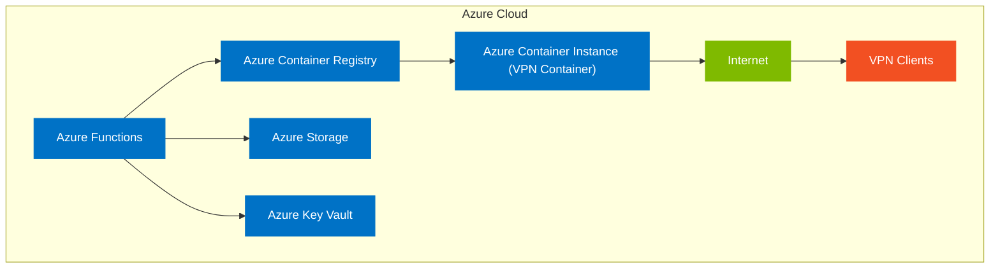

# Architecture Design: Container-Based VPN Solution (ACI)

## Overview
This document details the architectural design for implementing an on-demand VPN solution using Azure Container Instances (ACI) with containerized VPN software. This design follows Option 2 from the implementation options document, selected for its balance of flexibility, cost-effectiveness, and relatively quick startup times.

## System Components

### 1. Azure Container Instances (ACI)
- **Purpose**: Hosts the containerized VPN server software
- **Configuration**:
  - Container size: 1 vCPU, 1.5 GB RAM (adjustable based on performance needs)
  - OS: Linux
  - Restart policy: Always (when active)
  - IP allocation: Public
  - Ports: UDP 51820 (WireGuard), TCP/UDP 1194 (OpenVPN), or as configured
- **Lifecycle**: Created on-demand and destroyed when not in use

### 2. Docker VPN Images
- **Options**:
  - WireGuard (recommended for performance)
  - OpenVPN (recommended for compatibility)
  - SoftEther (alternative with multi-protocol support)
- **Base Image**: Alpine Linux for minimal footprint
- **Custom Configuration**: Added startup scripts for dynamic configuration
- **Version Control**: Tagged images in Azure Container Registry

### 3. Azure Container Registry (ACR)
- **Purpose**: Stores and manages custom VPN Docker images
- **SKU**: Basic tier
- **Security**: Private registry with Azure AD authentication
- **CI/CD Integration**: Automated builds from source repository

### 4. Azure Functions
- **Purpose**: Orchestration and automation of VPN infrastructure
- **Components**:
  - **StartVPN**: HTTP-triggered function to provision VPN container
  - **StopVPN**: HTTP-triggered function to deprovision VPN container
  - **CheckVPNStatus**: Timer-triggered function to monitor VPN health
  - **AutoShutdown**: Timer-triggered function to stop idle VPN instances
- **Runtime**: .NET 6.0 or Node.js 14
- **Authentication**: Azure AD with role-based access control

### 5. Azure Storage
- **Purpose**: Store configuration, certificates, and persistent data
- **Components**:
  - **Blob Storage**: VPN configuration files and certificates
  - **Table Storage**: User access records and session data
  - **Queue Storage**: Asynchronous processing of VPN operations
- **Redundancy**: Locally redundant storage (LRS)
- **Security**: Encrypted at rest and in transit

### 6. Azure Key Vault
- **Purpose**: Secure storage of certificates, keys, and secrets
- **Managed Identities**: Used for service-to-service authentication
- **Access Policies**: Least privilege principle for each component
- **Certificate Management**: Automated rotation and renewal

### 7. User Interface (Optional)
- **Options**:
  - **Static Web App**: Simple, cost-effective UI
  - **Azure App Service**: More feature-rich web application
  - **Mobile App**: For on-the-go VPN management
- **Authentication**: Azure AD B2C or Microsoft Entra ID

## Network Architecture

## Security Architecture

### Authentication and Authorization
- **User Authentication**: Azure AD integration
- **Service Authentication**: Managed identities
- **VPN Authentication**:
  - Certificate-based authentication (preferred)
  - Username/password as fallback
  - Optional multi-factor authentication

## Security and Access Control

### Authentication and Identity Management
- **Managed Identities**: All Azure services use system-assigned managed identities for secure, credential-less authentication between services
- **Azure AD Integration**: Centralized identity management through Microsoft Entra ID (Azure AD)
- **Multi-factor Authentication (MFA)**: Required for all administrative access

### Role-Based Access Control (RBAC)
- **Least Privilege Principle**: Minimum necessary permissions assigned to all identities
- **Custom Roles**: Define specific roles tailored to operational needs:
  - `VPN Operator`: Can start/stop VPN instances
  - `VPN Administrator`: Full VPN infrastructure management
  - `Auditor`: Read-only access to logs and metrics

### Resource Access Policies
- **Key Vault Access Policies**: Granular permissions for secrets, keys, and certificates
- **Network Restrictions**: Limit management access to approved IP ranges
- **Just-in-Time (JIT) Access**: For privileged operations when needed

### Service Principals and Managed Identities
- **System-assigned identities** for all Azure resources where possible
- **Service principals with certificates** for external automation
- **Automatic credential rotation** for all service principals

### Network Security
- **Network Security Groups (NSGs)**:
  - Restrict inbound traffic to VPN ports only
  - Limit management access to Azure Functions
- **Private Endpoints**:
  - For Storage and Key Vault access
- **IP Restrictions**:
  - Configurable allowlists for VPN client connections

### Data Security
- **Encryption in Transit**:
  - TLS 1.2+ for all Azure service communications
  - VPN protocol encryption (AES-256, ChaCha20)
- **Encryption at Rest**:
  - Azure Storage encryption
  - Key Vault-managed keys
- **Certificate Management**:
  - Automated rotation
  - Secure distribution to clients

## Automation Workflows

### VPN Provisioning Flow
1. User initiates VPN request via UI or API
2. Azure Function validates user permissions
3. Function checks for existing VPN instance
4. If none exists, Function creates new ACI instance
5. Container pulls configuration from Azure Storage
6. VPN service starts and registers public IP
7. Connection details returned to user
8. Monitoring begins for the active session

### VPN Deprovisioning Flow
1. User requests VPN shutdown or idle timeout occurs
2. Azure Function validates the request
3. Function gracefully stops VPN services
4. Usage metrics are recorded to Table Storage
5. ACI instance is deleted
6. Resources are released

## Cost Optimization

### On-Demand Resource Allocation
- VPN containers only run when needed
- Automatic shutdown of idle instances (configurable timeout)

### Resource Sizing
- Right-sized container instances based on expected load
- Minimal storage footprint with compressed configurations

### Estimated Costs
- **ACI**: ~$0.05/hour when running
- **Storage**: ~$0.02/GB/month (minimal usage expected)
- **Functions**: Most executions within free tier
- **Container Registry**: ~$5/month (Basic tier)
- **Key Vault**: ~$0.03/10,000 operations (minimal usage expected)

## Monitoring and Logging

### Azure Monitor Integration
- Container health metrics
- Function execution logs
- Performance counters

### Custom Metrics
- VPN connection counts
- Bandwidth utilization
- Authentication attempts (success/failure)

### Alerting
- Service availability alerts
- Security incident notifications
- Cost threshold warnings

## Disaster Recovery

### Backup Strategy
- Regular export of configuration to Azure Storage
- Certificate backups in Key Vault
- User access data in Table Storage

### Recovery Procedures
- Container recreation from registry images
- Configuration restoration from Storage
- Certificate restoration from Key Vault

## Implementation Phases

### Phase 1: Core Infrastructure
- Set up Azure Container Registry
- Create base VPN Docker images
- Implement core Azure Functions
- Configure Storage accounts

### Phase 2: Security Implementation
- Configure Key Vault
- Implement certificate management
- Set up authentication flows
- Configure network security

### Phase 3: User Interface
- Develop management interface
- Implement user authentication
- Create connection wizards
- Add monitoring dashboards

### Phase 4: Testing and Optimization
- Performance testing
- Security validation
- Cost optimization
- User acceptance testing

## Future Enhancements

- **Multi-region Support**: Deploy VPN endpoints in multiple Azure regions
- **Traffic Analysis**: Add optional traffic analysis for security monitoring
- **Split Tunneling**: Configure selective routing through VPN
- **Custom DNS**: Integrate with Azure DNS for custom name resolution
- **VPN Mesh**: Connect multiple VPN instances for redundancy

## Appendices

### A. Container Configuration Examples
- WireGuard configuration template
- OpenVPN configuration template
- SoftEther configuration template

### B. Function App Code Samples
- StartVPN function implementation
- StopVPN function implementation
- Health check implementation

### C. Infrastructure as Code Templates
- Bicep files for resource deployment
- Terraform configuration (alternative)
- GitHub Actions workflow examples
