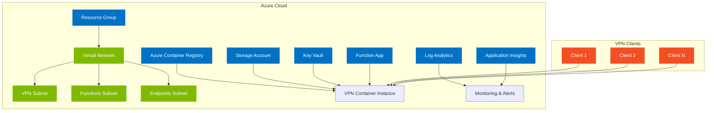

# Azure Demand VPN - Infrastructure as Code (Bicep)

This directory contains the complete Infrastructure as Code (IaC) solution for the Azure Demand VPN project using Azure Bicep templates.

## 🏗️ Architecture Overview

The Bicep templates deploy a comprehensive VPN infrastructure with the following components:



## 📁 File Structure

```
infra/
├── main.bicep                          # Main deployment template
├── modules/                            # Reusable Bicep modules
│   ├── log-analytics.bicep            # Log Analytics Workspace
│   ├── application-insights.bicep     # Application Insights
│   ├── network.bicep                  # Virtual Network & NSGs
│   ├── container-registry.bicep       # Azure Container Registry
│   ├── storage.bicep                  # Storage Account & containers
│   ├── key-vault.bicep                # Key Vault with private endpoints
│   ├── function-app.bicep             # Function App & App Service Plan
│   ├── vpn-container.bicep            # VPN Container template
│   └── monitoring.bicep               # Monitoring & alerting
├── parameters.dev.json                 # Development environment parameters
├── parameters.prod.json                # Production environment parameters
├── deploy.ps1                         # PowerShell deployment script
└── README.md                          # This file
```

## 🚀 Quick Start

### Prerequisites

1. **Azure CLI** - Latest version installed
2. **Bicep CLI** - Latest version installed
3. **Azure Subscription** - Active subscription with appropriate permissions
4. **PowerShell** - For running deployment scripts

### Installation

```bash
# Install Azure CLI (if not already installed)
# Windows: Download from https://aka.ms/installazurecliwindows
# macOS: brew install azure-cli
# Linux: curl -sL https://aka.ms/InstallAzureCLIDeb | sudo bash

# Install Bicep
az bicep install

# Login to Azure
az login
```

### Deployment

#### Option 1: Using PowerShell Script (Recommended)

```powershell
# Development deployment
.\deploy.ps1 -ResourceGroupName "rg-demand-vpn-dev" -Environment "dev"

# Production deployment (with What-If preview)
.\deploy.ps1 -ResourceGroupName "rg-demand-vpn-prod" -Environment "prod" -WhatIf

# Custom location
.\deploy.ps1 -ResourceGroupName "rg-demand-vpn-dev" -Environment "dev" -Location "West US 2"
```

#### Option 2: Using Azure CLI Directly

```bash
# Development deployment
az deployment group create \
  --resource-group rg-demand-vpn-dev \
  --template-file main.bicep \
  --parameters parameters.dev.json \
  --name vpn-deployment-$(date +%Y%m%d-%H%M%S)

# Production deployment
az deployment group create \
  --resource-group rg-demand-vpn-prod \
  --template-file main.bicep \
  --parameters parameters.prod.json \
  --name vpn-deployment-$(date +%Y%m%d-%H%M%S)
```

## 🔧 Configuration

### Environment Parameters

The solution supports three environments with different configurations:

| Environment | ACR SKU | Storage SKU | Function Plan | Max Connections | Cost Optimization |
|-------------|---------|-------------|---------------|-----------------|-------------------|
| **dev**     | Basic   | Standard_LRS | P1V2         | 50             | High             |
| **test**    | Standard| Standard_LRS | P1V2         | 100            | Medium           |
| **prod**    | Premium | Standard_GRS | P2V3         | 200            | Low              |

### Customization

You can customize the deployment by modifying the parameter files:

```json
{
  "vpnConfig": {
    "wireguardPort": 51820,
    "openvpnPort": 1194,
    "maxConnections": 100,
    "idleTimeoutMinutes": 30
  },
  "networkConfig": {
    "vnetAddressPrefix": "10.0.0.0/16",
    "vpnSubnetPrefix": "10.0.1.0/24"
  }
}
```

## 🏛️ Resource Details

### Virtual Network
- **Address Space**: 10.0.0.0/16
- **Subnets**:
  - VPN Subnet (10.0.1.0/24) - For VPN containers
  - Functions Subnet (10.0.2.0/24) - For Function App
  - Endpoints Subnet (10.0.3.0/24) - For private endpoints

### Network Security Groups
- **VPN NSG**: Allows WireGuard (UDP 51820), OpenVPN (UDP 1194), HTTPS (TCP 443)
- **Functions NSG**: Allows HTTP/HTTPS management traffic

### Storage Account
- **Containers**:
  - `vpn-configs` - VPN configuration files
  - `vpn-keys` - Public/private key pairs
  - `vpn-logs` - Connection logs
- **Security**: Private endpoints, encrypted at rest, VNet integration

### Key Vault
- **Features**: Soft delete, purge protection, RBAC authorization
- **Security**: Private endpoints, VNet integration
- **Purpose**: Store certificates, secrets, and keys

### Function App
- **Runtime**: .NET 6
- **Plan**: Premium (P1V2/P2V3) for VNet integration
- **Features**: Managed identity, VNet integration, Application Insights

### Container Registry
- **SKU**: Basic (dev) to Premium (prod)
- **Features**: Geo-replication (prod), admin access disabled
- **Purpose**: Store custom VPN container images

## 🔒 Security Features

- **Private Endpoints**: For Storage, Key Vault, and Container Registry
- **Network Security Groups**: Restrict traffic to necessary ports
- **Managed Identities**: Service-to-service authentication
- **Encryption**: At rest and in transit
- **RBAC**: Role-based access control
- **VNet Integration**: Isolate resources from public internet

## 📊 Monitoring & Alerting

### Log Analytics Workspace
- Centralized logging for all resources
- Custom queries for VPN-specific metrics
- Integration with Azure Monitor

### Application Insights
- Function App performance monitoring
- Request/response tracking
- Error rate monitoring

### Alerts
- VPN container health (CPU, memory)
- Function App errors (HTTP 5xx)
- Cost threshold alerts
- VPN connection count alerts

## 💰 Cost Optimization

### Development Environment
- Basic ACR SKU (~$5/month)
- Standard_LRS storage (~$0.02/GB/month)
- P1V2 Function Plan (~$20/month)
- Minimal monitoring

### Production Environment
- Premium ACR with geo-replication
- Standard_GRS storage for redundancy
- P2V3 Function Plan for performance
- Comprehensive monitoring and alerting

### Cost Management
- On-demand VPN container creation
- Automatic shutdown of idle instances
- Resource tagging for cost allocation
- Budget alerts and monitoring

## 🚨 Troubleshooting

### Common Issues

1. **Deployment Fails with Name Conflicts**
   ```bash
   # Check existing resources
   az resource list --resource-group <rg-name> --query "[].name"
   
   # Use unique project names or different locations
   ```

2. **VNet Integration Issues**
   ```bash
   # Verify subnet delegations
   az network vnet subnet show --resource-group <rg> --vnet-name <vnet> --name <subnet>
   
   # Check Function App VNet integration
   az functionapp vnet-integration list --name <app-name> --resource-group <rg>
   ```

3. **Private Endpoint Issues**
   ```bash
   # Verify DNS resolution
   nslookup <storage-account>.blob.core.windows.net
   
   # Check private endpoint status
   az network private-endpoint show --name <pe-name> --resource-group <rg>
   ```

### Logs and Diagnostics

```bash
# Function App logs
az functionapp logs tail --name <app-name> --resource-group <rg>

# Container logs
az container logs --resource-group <rg> --name <container-group>

# Key Vault diagnostics
az monitor diagnostic-settings list --resource <key-vault-id>
```

## 🔄 CI/CD Integration

### GitHub Actions Example

```yaml
name: Deploy Infrastructure
on:
  push:
    branches: [main]
  pull_request:
    branches: [main]

jobs:
  deploy:
    runs-on: ubuntu-latest
    steps:
      - uses: actions/checkout@v3
      
      - name: Azure Login
        uses: azure/login@v1
        with:
          creds: ${{ secrets.AZURE_CREDENTIALS }}
      
      - name: Deploy Dev
        run: |
          az deployment group create \
            --resource-group rg-demand-vpn-dev \
            --template-file infra/main.bicep \
            --parameters infra/parameters.dev.json
```

### Azure DevOps Pipeline

```yaml
trigger:
  - main

pool:
  vmImage: 'ubuntu-latest'

steps:
  - task: AzureCLI@2
    inputs:
      azureSubscription: 'Azure Subscription'
      scriptType: 'bash'
      scriptLocation: 'inlineScript'
      inlineScript: |
        az deployment group create \
          --resource-group rg-demand-vpn-dev \
          --template-file infra/main.bicep \
          --parameters infra/parameters.dev.json
```

## 📚 Additional Resources

- [Azure Bicep Documentation](https://docs.microsoft.com/en-us/azure/azure-resource-manager/bicep/)
- [Azure Container Instances](https://docs.microsoft.com/en-us/azure/container-instances/)
- [Azure Functions VNet Integration](https://docs.microsoft.com/en-us/azure/azure-functions/functions-networking-options)
- [Azure Private Endpoints](https://docs.microsoft.com/en-us/azure/private-link/private-endpoint-overview)
- [Azure VPN Best Practices](https://docs.microsoft.com/en-us/azure/vpn-gateway/vpn-gateway-about-vpn-gateway-settings)

## 🤝 Contributing

1. Fork the repository
2. Create a feature branch
3. Make your changes
4. Test with `--what-if` flag
5. Submit a pull request

## 📄 License

This project is licensed under the MIT License - see the LICENSE file for details.

## 🆘 Support

For issues and questions:
1. Check the troubleshooting section above
2. Review Azure documentation
3. Create an issue in the repository
4. Contact the development team
