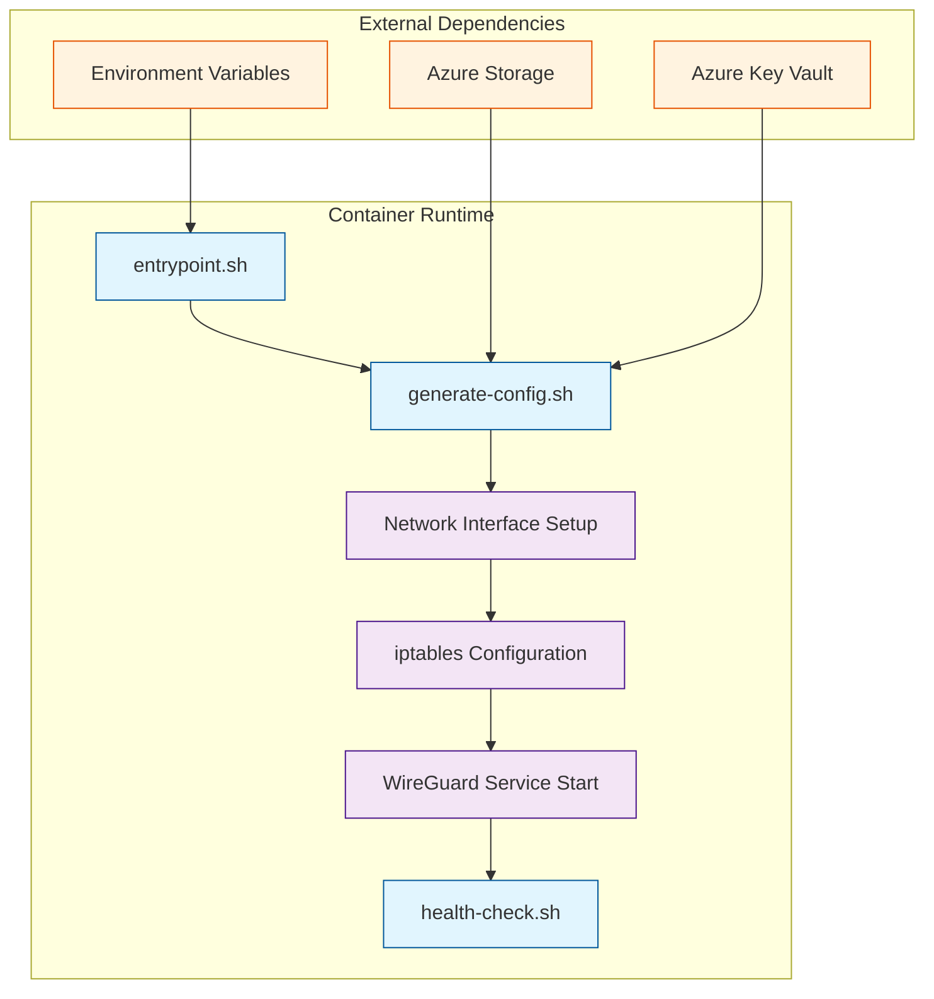

# WireGuard VPN Container Implementation

This directory contains the complete implementation of the WireGuard VPN container as specified in section 2.1 of the MVP specification.

## Overview

The WireGuard container provides a lightweight, secure VPN server that can be deployed on Azure Container Instances. It includes:

- **Alpine Linux base** for minimal size and security
- **WireGuard tools** for VPN functionality
- **Dynamic configuration generation** for flexible deployment
- **Health monitoring** and logging
- **Network security** with proper iptables rules

## Architecture



## File Structure

```
infra/container/
├── Dockerfile                 # Container image definition
├── .dockerignore             # Docker build exclusions
├── build.ps1                 # PowerShell build script
├── README.md                 # This documentation
└── scripts/
    ├── entrypoint.sh         # Container startup script
    ├── generate-config.sh    # Configuration generator
    └── health-check.sh       # Health monitoring script
```

## Prerequisites

- **Docker** installed and running
- **Azure CLI** (for pushing to ACR)
- **PowerShell** 5.1 or later
- **Azure Container Registry** deployed

## Quick Start

### 1. Build the Container Image

```powershell
# Navigate to container directory
cd infra/container

# Build with default settings
.\build.ps1

# Build with specific tag
.\build.ps1 -ImageTag v1.0.0

# Build and push to ACR
.\build.ps1 -PushToRegistry
```

### 2. Test Locally

```bash
# Run container with minimal configuration
docker run --rm -it \
  --cap-add=NET_ADMIN \
  --cap-add=SYS_MODULE \
  -e WG_SERVER_ADDRESS=10.8.0.1 \
  -e WG_SERVER_PORT=51820 \
  wireguard-vpn:latest

# Run with custom network
docker run --rm -it \
  --cap-add=NET_ADMIN \
  --cap-add=SYS_MODULE \
  --network host \
  -e WG_SERVER_ADDRESS=10.8.0.1 \
  -e WG_SERVER_PORT=51820 \
  wireguard-vpn:latest
```

### 3. Deploy to Azure Container Instances

```powershell
# Deploy using Azure CLI
az container create \
  --resource-group rg-az-demand-vpn-mvp \
  --name wireguard-vpn \
  --image acrazdemandvpn.azurecr.io/wireguard-vpn:latest \
  --registry-login-server acrazdemandvpn.azurecr.io \
  --registry-username <username> \
  --registry-password <password> \
  --ports 51820 \
  --protocol UDP \
  --environment-variables \
    WG_SERVER_ADDRESS=10.8.0.1 \
    WG_SERVER_PORT=51820 \
  --cpu 1 \
  --memory 1Gi \
  --capabilities NET_ADMIN SYS_MODULE
```

## Configuration

### Environment Variables

| Variable | Required | Default | Description |
|----------|----------|---------|-------------|
| `WG_SERVER_PRIVATE_KEY` | Yes | Auto-generated | WireGuard server private key |
| `WG_SERVER_PUBLIC_KEY` | Yes | Auto-generated | WireGuard server public key |
| `WG_SERVER_ADDRESS` | Yes | - | Server IP address (e.g., 10.8.0.1) |
| `WG_SERVER_PORT` | Yes | 51820 | UDP port for WireGuard |

### Network Configuration

The container automatically configures:

- **WireGuard interface** (`wg0`) with specified IP address
- **NAT rules** for client traffic routing
- **Forwarding rules** for VPN traffic
- **DNS configuration** (8.8.8.8, 1.1.1.1)
- **MTU optimization** (1420 bytes)

### Security Features

- **Privilege escalation** only for required capabilities
- **Network isolation** with proper iptables rules
- **Secure key generation** and management
- **Health monitoring** and logging
- **Graceful shutdown** handling

## Scripts Reference

### entrypoint.sh

Main container startup script that:

1. **Validates environment variables**
2. **Generates WireGuard keys** (if not provided)
3. **Creates configuration files**
4. **Sets up network interface**
5. **Configures iptables rules**
6. **Starts WireGuard service**
7. **Monitors health** continuously

### generate-config.sh

Configuration generator that:

1. **Creates server configuration** (`wg0.conf`)
2. **Generates client templates**
3. **Validates configuration syntax**
4. **Supports dynamic client generation**
5. **Creates QR codes** for mobile clients

### health-check.sh

Health monitoring script that:

1. **Checks WireGuard interface** status
2. **Monitors service health**
3. **Tests network connectivity**
4. **Tracks resource usage**
5. **Generates health reports** (JSON format)

## Monitoring and Logging

### Log Files

- `/var/log/wireguard/startup.log` - Container startup logs
- `/var/log/wireguard/config.log` - Configuration generation logs
- `/var/log/wireguard/health.log` - Health check logs
- `/var/log/wireguard/health-report.json` - Health status report

### Health Checks

The container includes Docker health checks that:

- **Run every 30 seconds**
- **Timeout after 10 seconds**
- **Start after 5 seconds** of container startup
- **Retry up to 3 times** before marking unhealthy

### Metrics

Health reports include:

- **Interface status** (healthy/unhealthy)
- **Service status** (healthy/unhealthy)
- **Network connectivity** status
- **Resource usage** (memory, disk, CPU)
- **Active peer count**

## Troubleshooting

### Common Issues

#### Container Won't Start

```bash
# Check container logs
docker logs <container_id>

# Verify environment variables
docker exec <container_id> env | grep WG_

# Check container capabilities
docker inspect <container_id> | grep -A 10 "Capabilities"
```

#### Network Issues

```bash
# Check WireGuard interface
docker exec <container_id> ip link show wg0

# Verify iptables rules
docker exec <container_id> iptables -L -n

# Test connectivity
docker exec <container_id> ping -c 3 8.8.8.8
```

#### Configuration Problems

```bash
# Validate WireGuard config
docker exec <container_id> wg-quick strip /etc/wireguard/wg0.conf

# Check configuration files
docker exec <container_id> ls -la /etc/wireguard/

# View generated config
docker exec <container_id> cat /etc/wireguard/wg0.conf
```

### Debug Mode

Enable debug logging by setting:

```bash
docker run -e DEBUG=true ... wireguard-vpn:latest
```

## Performance Optimization

### Resource Recommendations

- **CPU**: 1 vCPU minimum, 2 vCPU recommended
- **Memory**: 1 GB minimum, 2 GB recommended
- **Network**: Standard tier minimum

### Tuning Parameters

- **MTU**: Optimized to 1420 bytes for most networks
- **Keepalive**: 25 seconds for NAT traversal
- **Health check interval**: 30 seconds
- **Log rotation**: Automatic cleanup

## Security Considerations

### Container Security

- **Minimal base image** (Alpine Linux)
- **Least privilege** principle
- **Required capabilities only** (NET_ADMIN, SYS_MODULE)
- **No root user** execution

### Network Security

- **UDP port 51820** only exposed
- **Private network** (10.8.0.0/24)
- **NAT isolation** from host network
- **Secure key exchange**

### Key Management

- **Automatic key generation** if not provided
- **Secure storage** in Azure Key Vault
- **Key rotation** support
- **No hardcoded keys**

## Integration with Azure

### Azure Container Registry

```powershell
# Login to ACR
az acr login --name acrazdemandvpn

# Push image
docker push acrazdemandvpn.azurecr.io/wireguard-vpn:latest

# Pull image
docker pull acrazdemandvpn.azurecr.io/wireguard-vpn:latest
```

### Azure Container Instances

```powershell
# Deploy with managed identity
az container create \
  --resource-group rg-az-demand-vpn-mvp \
  --name wireguard-vpn \
  --image acrazdemandvpn.azurecr.io/wireguard-vpn:latest \
  --assign-identity [system] \
  --environment-variables \
    WG_SERVER_ADDRESS=10.8.0.1 \
    WG_SERVER_PORT=51820
```

### Azure Functions Integration

The container is designed to work with Azure Functions for:

- **Dynamic provisioning** of VPN instances
- **Configuration management** via Azure Storage
- **Key management** via Azure Key Vault
- **Monitoring** via Application Insights

## Development

### Building from Source

```bash
# Clone repository
git clone <repository-url>
cd az-demand-vpn

# Build container
cd infra/container
docker build -t wireguard-vpn:dev .

# Run tests
docker run --rm wireguard-vpn:dev /scripts/health-check.sh
```

### Contributing

1. **Fork the repository**
2. **Create feature branch**
3. **Make changes**
4. **Test thoroughly**
5. **Submit pull request**

### Testing

```bash
# Run health checks
docker exec <container_id> /scripts/health-check.sh

# Test configuration generation
docker exec <container_id> /scripts/generate-config.sh

# Validate WireGuard config
docker exec <container_id> wg-quick strip /etc/wireguard/wg0.conf
```

## Support

### Documentation

- **MVP Specification**: `docs/specs/mvp-wireguard-container-spec.md`
- **Architecture Design**: `docs/architecture-design.md`
- **Infrastructure Guide**: `infra/README.md`

### Issues

Report issues via:
- **GitHub Issues** for code problems
- **Azure Support** for infrastructure issues
- **Team documentation** for operational questions

---

**Version**: 1.0  
**Last Updated**: June 17, 2025  
**Compatibility**: Azure Container Instances, Docker 20.10+  
**WireGuard Version**: Latest stable (via Alpine package)
